# Angular && Observables

## Introduction

Performance &

Elegância &

Possibilidades &

Matemática &

Mini-prova feelings

## History

Do clááássico Gang of Four:


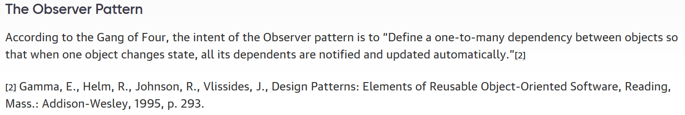

[The Reactive Manifesto (2014)](https://www.reactivemanifesto.org/):

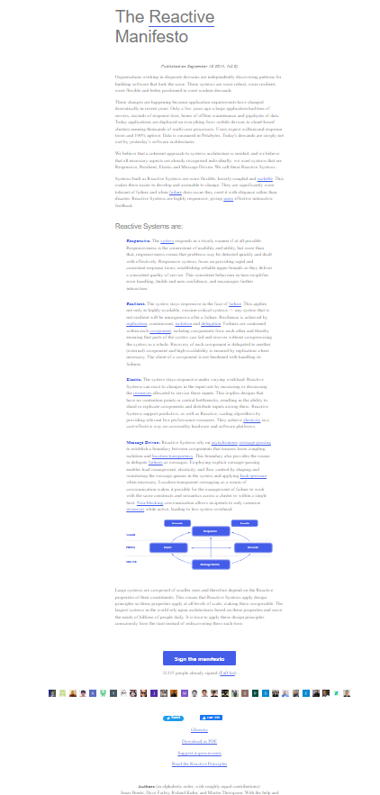

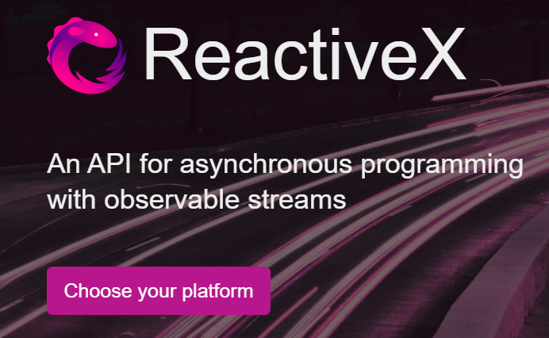

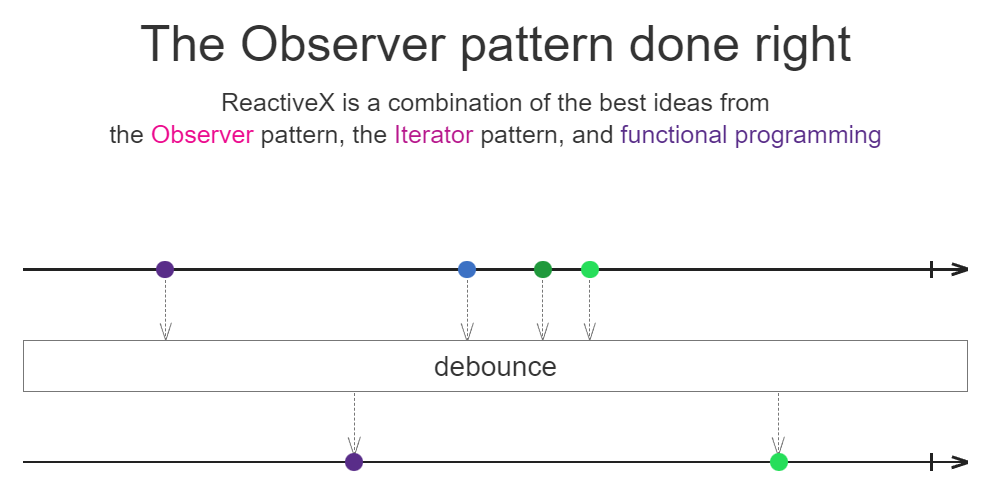

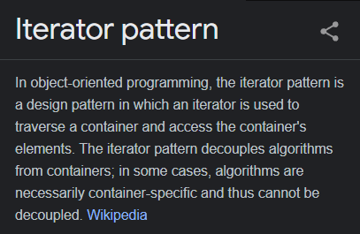

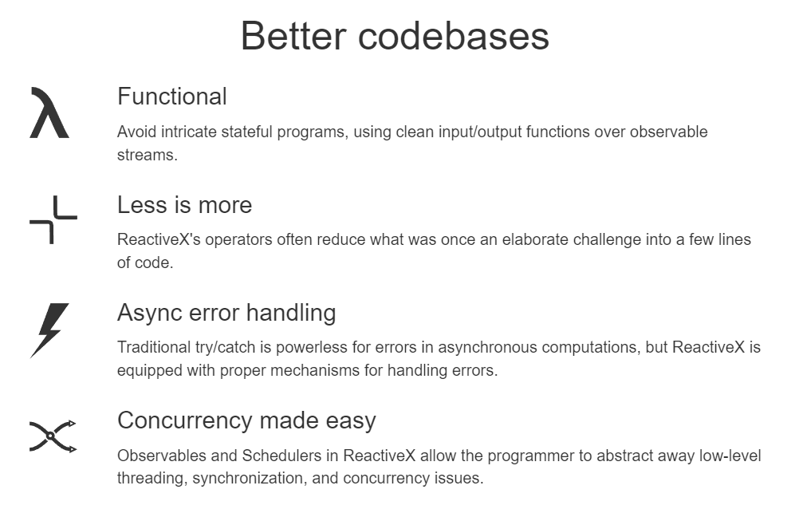

### Where is it used?

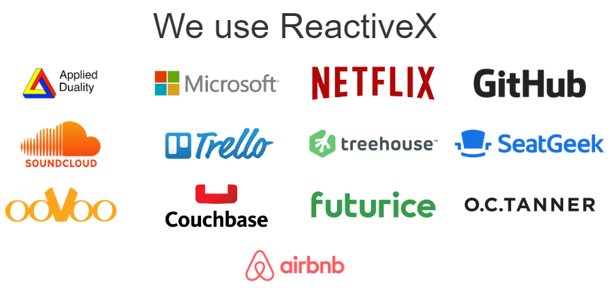


### What Angular has to do with it?

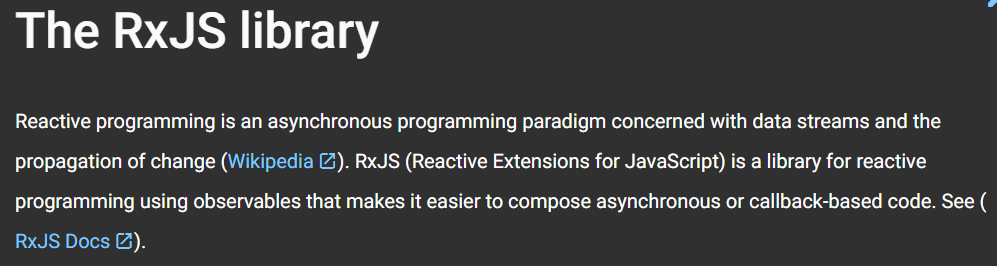

## Observables big picture

Streams?

Observables?

---

Tipo escalar, de boinha, normal e
tal:

```typescript
const x: 🍬 = 🍫
```

---

Array:

```typescript
const x: Array<🍬> = [🍫, 🍫, 🍫]
```

---

---

Stream?

```typescript
const x: Stream<🍬> = ❓
```

---

👯‍♂️ _Experimento paçoquita_ 👯‍♂️

### Analogies

River


- Intermitentes/Perenes
- Afluentes
- Precisa de uma nascente/fonte

---

Encanamento, Caixa d'água, pias

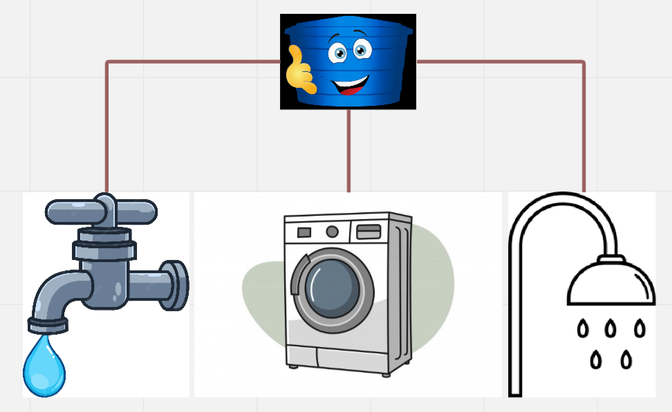

- Consumers/Subscriptions
- Elemento central distribuidor
- Torneiras fechadas -> zero água
- Torneiras abertas e caixa d'água vazia -> zero fluxo
- async!

## Basic working

1. Source (`interval`, `of`, `from`)
1. Operators (`map`, `filter`, `take`, `skip`, `delay`, `debounce`, `tap`)
1. Consumer (`subscribe`)

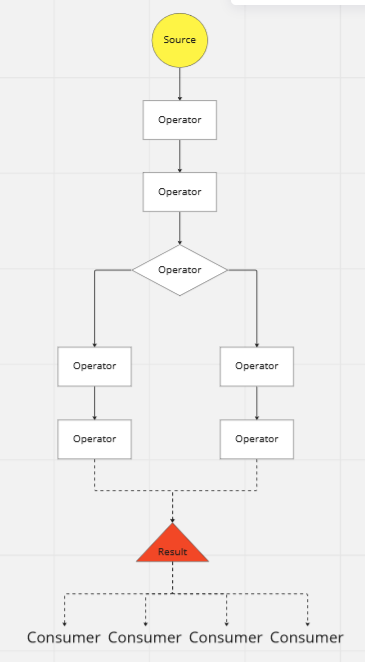

## 🏷️Full observable experiment👩‍🔬

## 🎾Playground🏀

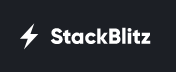

[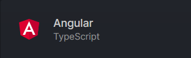](https://stackblitz.com/fork/angular-ivy)

## Login Form with Observables

<iframe src="https://giphy.com/embed/aMEHmZLDonNSjkPuam" width="480" height="270" frameBorder="0" class="giphy-embed" allowFullScreen></iframe><p><a href="https://giphy.com/gifs/etrade-off-the-grid-talking-baby-etrade-aMEHmZLDonNSjkPuam">via GIPHY</a></p>

## Login Form with Observables


